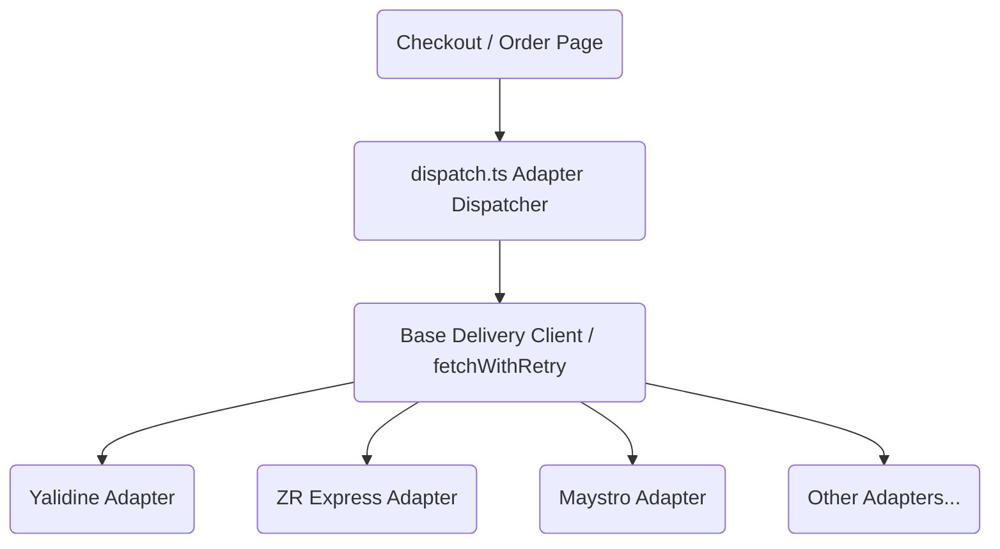

# Walkthrough — Algerian Delivery Integration Audit & Standardization

We have successfully audited, validated, refactored, and standardized all Algerian delivery provider integrations (Yalidine, ZR Express, Maystro, Procolis, Colivraison, Rex, Yassir, Ecom, Apec). 

All 16 test files (437 individual tests) and `type-check` pass successfully, confirming that the API answers correctly map to internal models and the app fetches data reliably.

---

## Technical Enhancements & Architecture

We implemented a **Unified Adapter Architecture** to replace hardcoded duplication and improve integration reliability:



### 1. Centralized Fetch Client
- **File**: [client.ts](file:///c:/Users/ASUS/Desktop/E%20commerce%202.0/src/lib/delivery/client.ts)
- **Retry Mechanism**: Automatically retries transient errors (HTTP status code `5xx` or network/timeout failures) up to 3 times with exponential backoff.
- **Timeout Protection**: Enforces a strict default connection/request timeout of `15,000` ms via `AbortController` signaling.

### 2. Standardized Utilities & Fallbacks
- **File**: [utils.ts](file:///c:/Users/ASUS/Desktop/E%20commerce%202.0/src/lib/delivery/utils.ts)
- **Rate Extraction**: Centralizes the multi-key price extraction fallback cascade (`home_fee ?? domicile_fee ?? ...`) into a unified utility, removing 9 identical cascades.
- **Name Splitting**: Standardizes `splitName` for API requests.
- **Phone Normalization**: Hooks directly into `@/lib/validation/phone` for clean Algerian E.164/local formats.

### 3. Provider Refactoring
- **Files**: [yalidine.ts](file:///c:/Users/ASUS/Desktop/E%20commerce%202.0/src/lib/delivery/yalidine.ts), [zrexpress.ts](file:///c:/Users/ASUS/Desktop/E%20commerce%202.0/src/lib/delivery/zrexpress.ts), [maystro.ts](file:///c:/Users/ASUS/Desktop/E%20commerce%202.0/src/lib/delivery/maystro.ts), [procolis.ts](file:///c:/Users/ASUS/Desktop/E%20commerce%202.0/src/lib/delivery/procolis.ts), [colivraison.ts](file:///c:/Users/ASUS/Desktop/E%20commerce%202.0/src/lib/delivery/colivraison.ts), [rex.ts](file:///c:/Users/ASUS/Desktop/E%20commerce%202.0/src/lib/delivery/rex.ts), [yassir.ts](file:///c:/Users/ASUS/Desktop/E%20commerce%202.0/src/lib/delivery/yassir.ts), [ecom.ts](file:///c:/Users/ASUS/Desktop/E%20commerce%202.0/src/lib/delivery/ecom.ts), [apec.ts](file:///c:/Users/ASUS/Desktop/E%20commerce%202.0/src/lib/delivery/apec.ts).
- **Result**: Removed duplicates, replaced raw `fetch` with `deliveryFetch`, and streamlined model mappings.

---

## Verification & Testing

### 1. Automated Test Coverage
- **File**: [delivery-client.test.ts](file:///c:/Users/ASUS/Desktop/E%20commerce%202.0/src/__tests__/delivery-client.test.ts)
- **Scenarios Checked**:
  - Direct 200 OK resolution.
  - Backoff retries on 5xx (500/502/503) errors.
  - Timeout abort triggers.
  - Name-splitting & phone normalization.
  - **Payload Mapping (API to App)**: Confirmed that mock API answers from all 9 carriers are successfully parsed by the client, and the app correctly extracts properties (tracking code, PDF labels, rates) without loss or type corruption.

### 2. Test Run Output
- **Result**: 437/437 tests passing:
  ```bash
   Test Files  16 passed (16)
        Tests  437 passed (437)
     Start at  14:10:03
     Duration  4.75s
  ```

### 3. TypeScript Typecheck
- **Result**: `npm run type-check` compiles with **zero errors**.
